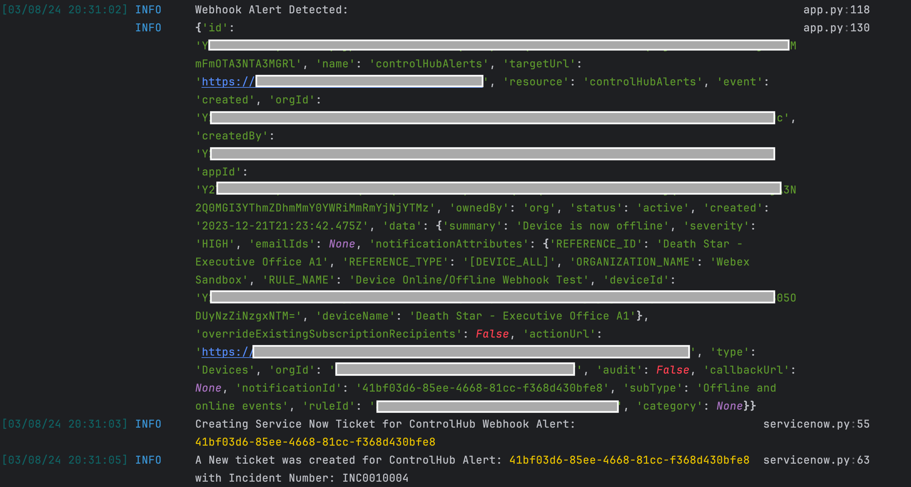
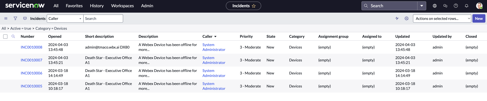

# Webex Control Hub Alerts Servicenow Integration

This integration creates ServiceNow Incidents based on received Control Hub Alerts. Incidents are created with a combination of `custom configuration` and raw alert data. 

**Note**: This integration does **NOT** clear alerts on Webex Control Hub when they are resolved in ServiceNow, and this integration sets ServiceNow Incident `Short Description` to the name of the Alerting Device.

Supported Control Hub Alerts:
* Device Offline (10 minutes - not configurable)
* Issues:
  * Audio (Microphone Connected)
  * Camera (Pairing)
  * Display (Missing Display, Missing Third Display)
  * System (Connection)
  * Touch Panel (Connection)
  * Video (OSD Video Output)
* Device Live Meeting Alert (latency, loss, etc.)

## Contacts
* Trevor Maco

## Solution Components
* Webex Control Hub 
* ServiceNow

## Prerequisites
### Control Hub Configurations
In order to create ServiceNow incidents based on Webex Control Hub Alerts, a `Webhook` and `Alert Rule` must be defined in Control Hub.
* `Webhook`: To create a Webhook, follow this [documentation](https://help.webex.com/en-us/article/3gv4ci/Enable-webhooks-for-alerts-in-Control-Hub). The Webhook URL must be the HTTPS URL of the machine hosting this integration (publicly reachable from the Internet). For local testing, [ngrok](https://ngrok.com/download) can be used by copying the URL from the following command:
```
ngrok http 5000
```
**Note**: please include a `Secret Token`, and note it down for later.

* `Alert Rule`: To create an Alert Rule, follow this [documentation](https://help.webex.com/en-us/article/u3uiam/Device-alerts-in-Control-Hub). Be sure to selected `Webhook` as one of the Delivery channels! Make sure the chosen alert is supported by this application.

### Alert to ServiceNow Custom Configuration
This integration utilizes configurations mapped to each supported alert type which include the fields required by the ServiceNow API. Configurations are organized in the `alert_configurations` folder by `Service` (devices, meetings) and `Type` (issues, offline_online, device_live_meeting). 

Configurations are within the respective `config.json`. **DO NOT** modify the top level values (ex: `offline`). All other fields can be modified, and they control ticket creation behavior for the specified alert.

### ServiceNow
For integrating with ServiceNow, gather the `url` and `username`/`password` for a ServiceNow Admin associated with the target ServiceNow instance. A free developer instance can be created with the [Developer Program](https://developer.servicenow.com/)

### Docker
This app provides a `Docker` file for easy deployment. `Docker` is the recommended deployment method. Install `Docker` [here](https://docs.docker.com/get-docker/).

## Installation/Configuration
1. Clone this repository with `git clone [repository name]`. To find the repository name, click the green `Code` button above the repository files. Then, the dropdown menu will show the https domain name. Click the copy button to the right of the domain name to get the value to replace [repository name] placeholder.

2. Rename the `.env_sample` file to `.env`.
3. Add the Control Hub Webhook `Secret Token` to `.env` from the prerequisites section.
```dotenv
# Webex Control Hub Webhook Configs
WEBHOOK_SECRET="secret"
```
4. Add the `ServiceNow Instance Variables` to `.env` from the prerequisites section.
```dotenv
# ServiceNow Section
SERVICENOW_INSTANCE="https://<something>.com"
SERVICENOW_USERNAME="admin"
SERVICENOW_PASSWORD="admin"
```
5. Set up a Python virtual environment. Make sure Python 3 is installed in your environment, and if not, you may download Python [here](https://www.python.org/downloads/). Once Python 3 is installed in your environment, you can activate the virtual environment with the instructions found [here](https://docs.python.org/3/tutorial/venv.html).
6. Install the requirements with `pip3 install -r requirements.txt`

## Usage
To run this integration, use the following command to run with python directly:
```
$ python3 src/app.py
```
or with the docker command:
```
$ docker-compose up -d --build
```

**Notes**: 
* App logs and output are written to stdout console and log files in `src/logs`

Once the app is running, it's now ready to receive Webhook Alerts from Control Hub. When an Alert is received (ex: "Device Offline"), the following output will be displayed to the console:



and a ServiceNow Ticket will be created:




### LICENSE

Provided under Cisco Sample Code License, for details see [LICENSE](LICENSE.md)

### CODE_OF_CONDUCT

Our code of conduct is available [here](CODE_OF_CONDUCT.md)

### CONTRIBUTING

See our contributing guidelines [here](CONTRIBUTING.md)

#### DISCLAIMER:
<b>Please note:</b> This script is meant for demo purposes only. All tools/ scripts in this repo are released for use "AS IS" without any warranties of any kind, including, but not limited to their installation, use, or performance. Any use of these scripts and tools is at your own risk. There is no guarantee that they have been through thorough testing in a comparable environment and we are not responsible for any damage or data loss incurred with their use.
You are responsible for reviewing and testing any scripts you run thoroughly before use in any non-testing environment.